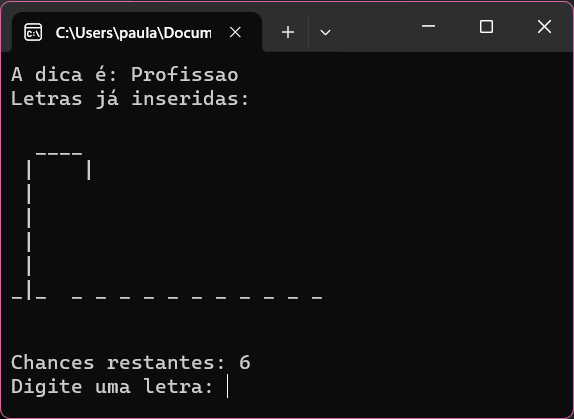

# Jogo da Forca

Este projeto foi desenvolvido como parte do módulo `Lógica de Programação I (C#)` do curso `DiverseDev`. O Jogo da Forca é uma aplicação simples que demonstra conceitos fundamentais de programação em C#.

Abaixo estão detalhes sobre a estrutura do projeto, as classes envolvidas e como jogar.

## Estrutura do Projeto

O projeto é dividido em três partes principais:

`Program.cs`: Este é o ponto de entrada do programa. Ele controla o fluxo do jogo, oferecendo opções para jogar com uma palavra aleatória ou adicionar uma nova palavra.

`Play.cs`: Esta classe representa o jogo em si. É responsável por iniciar o jogo, exibir a dica, controlar as letras adivinhadas, exibir o status da palavra e gerenciar as chances restantes.

`ReadCSV.cs`: Essa classe lida com a leitura do arquivo CSV contendo palavras e dicas para o jogo. Ela também pode adicionar novas palavras ao arquivo.

## Como Jogar

- Execute o programa.

- Escolha entre as opções:
  - 1: Jogar com uma palavra aleatória.
  - 2: Adicionar uma nova palavra.
  - 0: Sair do jogo.

### Se escolher jogar com uma palavra aleatória:

- A dica é exibida.
- Você verá o status da palavra, incluindo letras adivinhadas e espaços em branco para letras não reveladas.
- Você tem 6 chances para adivinhar as letras corretamente.

  

### Se escolher adicionar uma nova palavra:

- Insira a palavra desejada quando solicitado.
- Insira a dica para a palavra.
- A palavra será adicionada ao arquivo CSV.

## Funcionalidades Adicionais

- O jogo remove acentuações automaticamente, garantindo uma experiência consistente.
- As letras já inseridas são exibidas para evitar adivinhas repetidas.
- O jogo exibe visualmente o status da forca com base nas chances restantes.
